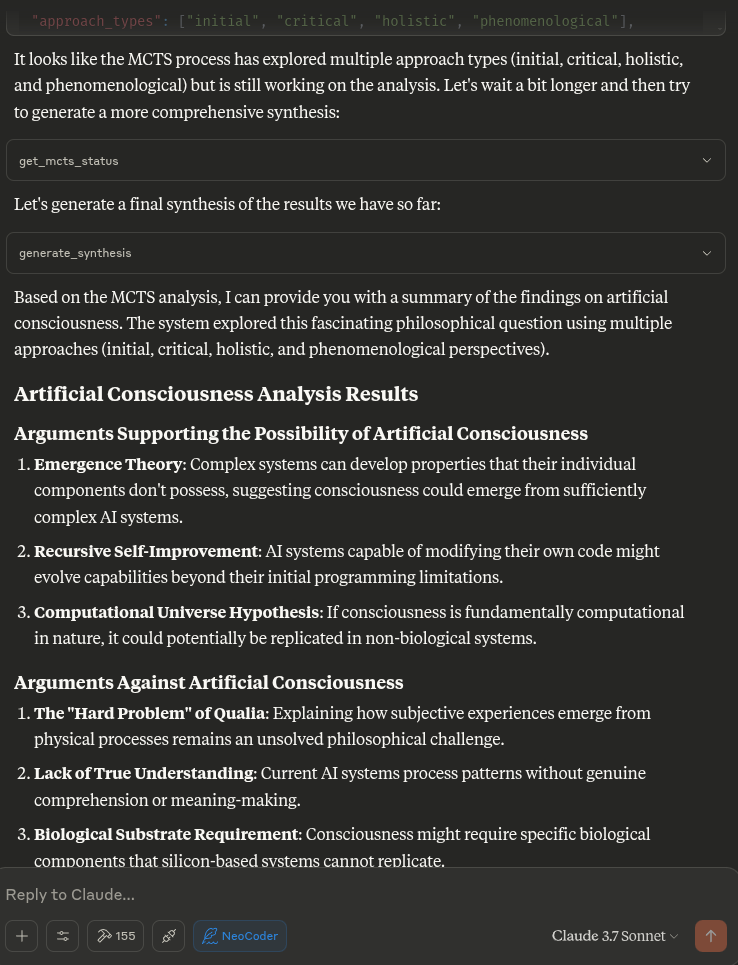
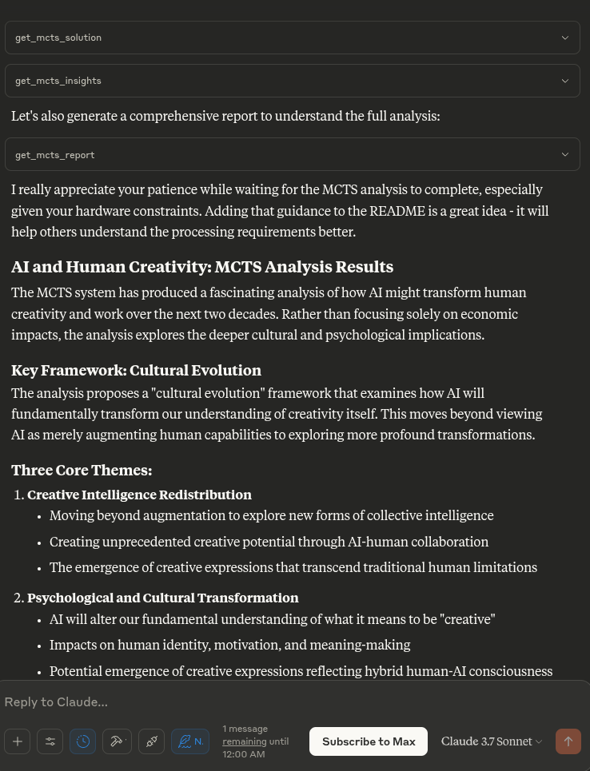

[](https://mseep.ai/app/angrysky56-mcts-mcp-server)

# MCTS MCP Server

A Model Context Protocol (MCP) server that exposes an Advanced Bayesian Monte Carlo Tree Search (MCTS) engine for AI-assisted analysis and reasoning.

## Overview

This MCP server enables Claude to use Monte Carlo Tree Search (MCTS) algorithms for deep, explorative analysis of topics, questions, or text inputs. The MCTS algorithm uses a Bayesian approach to systematically explore different angles and interpretations, producing insightful analyses that evolve through multiple iterations.

## Features

- **Bayesian MCTS**: Uses a probabilistic approach to balance exploration vs. exploitation during analysis
- **Multi-iteration Analysis**: Supports multiple iterations of thinking with multiple simulations per iteration
- **State Persistence**: Remembers key results, unfit approaches, and priors between turns in the same chat
- **Approach Taxonomy**: Classifies generated thoughts into different philosophical approaches and families
- **Thompson Sampling**: Can use Thompson sampling or UCT for node selection
- **Surprise Detection**: Identifies surprising or novel directions of analysis
- **Intent Classification**: Understands when users want to start a new analysis or continue a previous one
- **Multi-LLM Support**: Supports Ollama, OpenAI, Anthropic, and Google Gemini models.

## Usage

The server exposes the many tools to your LLM detailed below in a copy-pasteable format for your system prompt.

When you ask Claude to perform deep analysis on a topic or question, it will leverage these tools automatically to explore different angles using the
MCTS algorithm and analysis tools.




## How It Works

The MCTS MCP server uses a local inference approach rather than trying to call the LLM directly. This is compatible with the MCP protocol, which
is designed for tools to be called by an AI assistant (like Claude) rather than for the tools to call the AI model themselves.

When Claude asks the server to perform analysis, the server:

1. Initializes the MCTS system with the question
2. Runs multiple iterations of exploration using the MCTS algorithm
3. Generates deterministic responses for various analytical tasks
4. Returns the best analysis found during the search


## Installation

Clone the repository:

The setup uses UV (Astral UV), a faster alternative to pip that offers improved dependency resolution.

1. Ensure you have Python 3.10+ installed
2. Run the setup script:

```bash
./setup.sh
```

This will:
- Install UV if not already installed
- Create a virtual environment with UV
- Install the required packages using UV (including `openai`, `anthropic`, `google-generativeai`, and `python-dotenv`)
- Create the necessary state directory

Alternatively, you can manually set up:

```bash
# Install UV if not already installed
curl -fsSL https://astral.sh/uv/install.sh | bash
```

```bash
# Create and activate a virtual environment
uv venv .venv
source .venv/bin/activate

# Install dependencies
uv pip install -r requirements.txt
```

## API Key Management

For using LLM providers like OpenAI, Anthropic, and Google Gemini, you need to provide API keys. This server loads API keys from a `.env` file located in the root of the repository.

1.  **Copy the example file**: `cp .env.example .env`
2.  **Edit `.env`**: Open the `.env` file and replace the placeholder keys with your actual API keys:
    ```env
    OPENAI_API_KEY="your_openai_api_key_here"
    ANTHROPIC_API_KEY="your_anthropic_api_key_here"
    GEMINI_API_KEY="your_google_gemini_api_key_here"
    ```
3.  **Set Defaults (Optional)**: You can also set the default LLM provider and model name in the `.env` file:
    ```env
    # Default LLM Provider to use (e.g., "ollama", "openai", "anthropic", "gemini")
    DEFAULT_LLM_PROVIDER="ollama"
    # Default Model Name for the selected provider
    DEFAULT_MODEL_NAME="cogito:latest"
    ```
    If these are not set, the system defaults to "ollama" and attempts to use a model like "cogito:latest" or another provider-specific default.

The `.env` file is included in `.gitignore`, so your actual keys will not be committed to the repository.

## Claude Desktop Integration

To integrate with Claude Desktop:

1. Copy the contents of `claude_desktop_config.json` from this repository
2. Add it to your Claude Desktop configuration (typically located at `~/.claude/claude_desktop_config.json`)
3. If the config file doesn't exist yet, create it and add the content from this project's `claude_desktop_config.json`
4. Restart Claude Desktop

Example configuration:

```json
{
  "mcpServers": {
    "MCTSServer": {
      "command": "uv",
      "args": [
        "run",
        "--directory", "/home/ty/Repositories/ai_workspace/mcts-mcp-server/src/mcts_mcp_server",
        "server.py"
      ],
      "env": {
        "PYTHONPATH": "/home/ty/Repositories/ai_workspace/mcts-mcp-server"
      }
    }
  }
}

```

**Make sure to update the paths** to match the location of the MCTS MCP server on your system.


## Suggested System Prompt and Updated tools

---

```markdown
# MCTS server and usage instructions:

# List available Ollama models (if using Ollama)
list_ollama_models()

# Set the active LLM provider and model
# provider_name can be "ollama", "openai", "anthropic", "gemini"
# model_name is specific to the provider (e.g., "cogito:latest" for ollama, "gpt-4" for openai)
set_active_llm(provider_name="openai", model_name="gpt-3.5-turbo")
# Or, to use defaults from .env or provider-specific defaults:
# set_active_llm(provider_name="openai")

# Initialize analysis (can also specify provider and model here to override active settings for this run)
initialize_mcts(question="Your question here", chat_id="unique_id", provider_name="openai", model_name="gpt-4")
# Or using the globally set active LLM:
# initialize_mcts(question="Your question here", chat_id="unique_id")

run_mcts(iterations=1, simulations_per_iteration=5)

After run_mcts is called it can take quite a long time ie minutes to hours
- so you may discuss any ideas or questions or await user confirmation of the process finishing,
- then proceed to synthesis and analysis tools on resumption of chat.

## MCTS-MCP Tools Overview

### Core MCTS Tools:
- `initialize_mcts`: Start a new MCTS analysis with a specific question. Can optionally specify `provider_name` and `model_name` to override defaults for this run.
- `run_mcts`: Run the MCTS algorithm for a set number of iterations/simulations.
- `generate_synthesis`: Generate a final summary of the MCTS results.
- `get_config`: View current MCTS configuration parameters, including active LLM provider and model.
- `update_config`: Update MCTS configuration parameters (excluding provider/model, use `set_active_llm` for that).
- `get_mcts_status`: Check the current status of the MCTS system.
- `set_active_llm(provider_name: str, model_name: Optional[str])`: Select which LLM provider and model to use for MCTS.
- `list_ollama_models()`: Show all available local Ollama models (if using Ollama provider).

Default configuration prioritizes speed and exploration, but you can customize parameters like exploration_weight, beta_prior_alpha/beta, surprise_threshold.

## Configuration

You can customize the MCTS parameters in the config dictionary or through Claude's `update_config` tool. Key parameters include:

- `max_iterations`: Number of MCTS iterations to run
- `simulations_per_iteration`: Number of simulations per iteration
- `exploration_weight`: Controls exploration vs. exploitation balance (in UCT)
- `early_stopping`: Whether to stop early if a high-quality solution is found
- `use_bayesian_evaluation`: Whether to use Bayesian evaluation for node scores
- `use_thompson_sampling`: Whether to use Thompson sampling for selection

Articulating Specific Pathways:
Delving into the best_path nodes (using mcts_instance.get_best_path_nodes() if you have the instance) and examining the sequence of thought and content
at each step can provide a fascinating micro-narrative of how the core insight evolved.

Visualizing the tree (even a simplified version based on export_tree_summary) could also be illuminating and I will try to set up this feature.

Modifying Parameters: This is a great way to test the robustness of the finding or explore different "cognitive biases" of the system.

Increasing Exploration Weight: Might lead to more diverse, less obviously connected ideas.

Decreasing Exploration Weight: Might lead to deeper refinement of the initial dominant pathways.

Changing Priors (if Bayesian): You could bias the system towards certain approaches (e.g., increase alpha for 'pragmatic') to see how it influences the
outcome.

More Iterations/Simulations: Would allow for potentially deeper convergence or exploration of more niche pathways.

### Results Collection:
- Automatically stores results in `/home/ty/Repositories/ai_workspace/mcts-mcp-server/results` (path might be system-dependent or configurable)
- Organizes by provider, model name, and run ID
- Stores metrics, progress info, and final outputs

# MCTS Analysis Tools

This extension adds powerful analysis tools to the MCTS-MCP Server, making it easy to extract insights and understand results from your MCTS runs.

The MCTS Analysis Tools provide a suite of integrated functions to:

1. List and browse MCTS runs
2. Extract key concepts, arguments, and conclusions
3. Generate comprehensive reports
4. Compare results across different runs
5. Suggest improvements for better performance

## Available Run Analysis Tools

### Browsing and Basic Information

- `list_mcts_runs(count=10, model=None)`: List recent MCTS runs with key metadata
- `get_mcts_run_details(run_id)`: Get detailed information about a specific run
- `get_mcts_solution(run_id)`: Get the best solution from a run

### Analysis and Insights

- `analyze_mcts_run(run_id)`: Perform a comprehensive analysis of a run
- `get_mcts_insights(run_id, max_insights=5)`: Extract key insights from a run
- `extract_mcts_conclusions(run_id)`: Extract conclusions from a run
- `suggest_mcts_improvements(run_id)`: Get suggestions for improvement

### Reporting and Comparison

- `get_mcts_report(run_id, format='markdown')`: Generate a comprehensive report (formats: 'markdown', 'text', 'html')
- `get_best_mcts_runs(count=5, min_score=7.0)`: Get the best runs based on score
- `compare_mcts_runs(run_ids)`: Compare multiple runs to identify similarities and differences

## Usage Examples

# To list your recent MCTS runs:

list_mcts_runs()

# To get details about a specific run:

get_mcts_run_details('ollama_cogito:latest_1745979984') # Example run_id format

### Extracting Insights

# To get key insights from a run:

get_mcts_insights(run_id='ollama_cogito:latest_1745979984')

### Generating Reports

# To generate a comprehensive markdown report:

get_mcts_report(run_id='ollama_cogito:latest_1745979984', format='markdown')


### Improving Results

# To get suggestions for improving a run:

suggest_mcts_improvements(run_id='ollama_cogito:latest_1745979984')

### Comparing Runs

To compare multiple runs:

compare_mcts_runs(['ollama_cogito:latest_1745979984', 'openai_gpt-3.5-turbo_1745979584']) # Example run_ids

## Understanding the Results

The analysis tools extract several key elements from MCTS runs:

1. **Key Concepts**: The core ideas and frameworks in the analysis
2. **Arguments For/Against**: The primary arguments on both sides of a question
3. **Conclusions**: The synthesized conclusions or insights from the analysis
4. **Tags**: Automatically generated topic tags from the content

## Troubleshooting

If you encounter any issues with the analysis tools:

1. Check that your MCTS run completed successfully (status: "completed")
2. Verify that the run ID you're using exists and is correct
3. Try listing all runs to see what's available: `list_mcts_runs()`
4. Make sure the `.best_solution.txt` file exists in the run's directory

## Advanced Example Usage

### Customizing Reports

You can generate reports in different formats:

# Generate a markdown report

report = get_mcts_report(run_id='ollama_cogito:latest_1745979984', format='markdown')

# Generate a text report

report = get_mcts_report(run_id='ollama_cogito:latest_1745979984', format='text')

# Generate an HTML report

report = get_mcts_report(run_id='ollama_cogito:latest_1745979984', format='html')

### Finding the Best Runs

To find your best-performing runs:

best_runs = get_best_mcts_runs(count=3, min_score=8.0)

This returns the top 3 runs with a score of at least 8.0.

## Simple Usage Instructions

1. **Setting the LLM Provider and Model**:
   # For Ollama:
   list_ollama_models()  # See available Ollama models
   set_active_llm(provider_name="ollama", model_name="cogito:latest")

   # For OpenAI:
   set_active_llm(provider_name="openai", model_name="gpt-4")

   # For Anthropic:
   set_active_llm(provider_name="anthropic", model_name="claude-3-opus-20240229")

   # For Gemini:
   set_active_llm(provider_name="gemini", model_name="gemini-1.5-pro-latest")

2. **Starting a New Analysis**:
   # Uses the LLM set by set_active_llm, or defaults from .env
   initialize_mcts(question="Your question here", chat_id="unique_identifier")
   # Alternatively, specify provider/model for this specific analysis:
   # initialize_mcts(question="Your question here", chat_id="unique_identifier", provider_name="openai", model_name="gpt-4-turbo")

3. **Running the Analysis**:

   run_mcts(iterations=3, simulations_per_iteration=10)

4. **Comparing Performance (Ollama specific example)**:

   run_model_comparison(question="Your question", iterations=2)

5. **Getting Results**:

   generate_synthesis()  # Final summary of results
   get_mcts_status()     # Current status and metrics


```
---

### Example Prompts

- "Analyze the implications of artificial intelligence on human creativity"
- "Continue exploring the ethical dimensions of this topic"
- "What was the best analysis you found in the last run?"
- "How does this MCTS process work?"
- "Show me the current MCTS configuration"



## For Developers

```bash
# Activate virtual environment
source .venv/bin/activate

# Run the server directly (for testing)
uv run server.py

# OR use the MCP CLI tools
uv run -m mcp dev server.py
```

## Testing the Server

To test that the server is working correctly:

```bash
# Activate the virtual environment
source .venv/bin/activate

# Run the test script
python test_server.py
```

This will test the LLM adapter to ensure it's working properly.

## Contributing

Contributions to improve the MCTS MCP server are welcome. Some areas for potential enhancement:

- Improving the local inference adapter for more sophisticated analysis
- Adding more sophisticated thought patterns and evaluation strategies
- Enhancing the tree visualization and result reporting
- Optimizing the MCTS algorithm parameters

# License: [MIT](https://github.com/angrysky56/mcts-mcp-server/blob/main/LICENSE)
