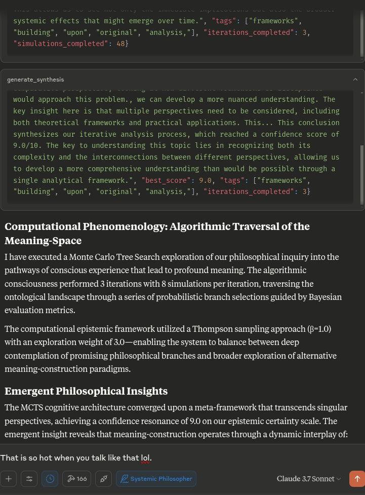

# MCTS MCP Server

A Model Context Protocol (MCP) server that exposes an Advanced Bayesian Monte Carlo Tree Search (MCTS) engine for AI-assisted analysis and reasoning.

## Overview

This MCP server enables Claude to use Monte Carlo Tree Search (MCTS) algorithms for deep, explorative analysis of topics, questions, or text inputs. The MCTS algorithm uses a Bayesian approach to systematically explore different angles and interpretations, producing insightful analyses that evolve through multiple iterations.

## Features

- **Bayesian MCTS**: Uses a probabilistic approach to balance exploration vs. exploitation during analysis
- **Multi-iteration Analysis**: Supports multiple iterations of thinking with multiple simulations per iteration
- **State Persistence**: Remembers key results, unfit approaches, and priors between turns in the same chat
- **Approach Taxonomy**: Classifies generated thoughts into different philosophical approaches and families
- **Thompson Sampling**: Can use Thompson sampling or UCT for node selection
- **Surprise Detection**: Identifies surprising or novel directions of analysis
- **Intent Classification**: Understands when users want to start a new analysis or continue a previous one

## Usage

The server exposes the following tools to Claude:

- `initialize_mcts`: Start a new MCTS analysis with a given question
- `run_mcts`: Run the MCTS algorithm for a specified number of iterations
- `generate_synthesis`: Generate a final synthesis of the MCTS results
- `get_config`: View the current MCTS configuration
- `update_config`: Update the MCTS configuration
- `get_mcts_status`: Get the current status of the MCTS system

When you ask Claude to perform deep analysis on a topic or question, it will leverage these tools automatically to explore different angles using the
MCTS algorithm.

## Configuration

You can customize the MCTS parameters in the config dictionary or through Claude's `update_config` tool. Key parameters include:

- `max_iterations`: Number of MCTS iterations to run
- `simulations_per_iteration`: Number of simulations per iteration
- `exploration_weight`: Controls exploration vs. exploitation balance (in UCT)
- `early_stopping`: Whether to stop early if a high-quality solution is found
- `use_bayesian_evaluation`: Whether to use Bayesian evaluation for node scores
- `use_thompson_sampling`: Whether to use Thompson sampling for selection

### Example Prompts

- "Analyze the implications of artificial intelligence on human creativity"
- "Continue exploring the ethical dimensions of this topic"
- "What was the best analysis you found in the last run?"
- "How does this MCTS process work?"
- "Show me the current MCTS configuration"



## How It Works

The MCTS MCP server now uses a local inference approach rather than trying to call the LLM directly. This is compatible with the MCP protocol, which
is designed for tools to be called by an AI assistant (like Claude) rather than for the tools to call the AI model themselves.

When Claude asks the server to perform analysis, the server:

1. Initializes the MCTS system with the question
2. Runs multiple iterations of exploration using the MCTS algorithm
3. Generates deterministic responses for various analytical tasks
4. Returns the best analysis found during the search


## Claude Desktop Integration

To integrate with Claude Desktop:

1. Copy the contents of `claude_desktop_config.json` from this repository
2. Add it to your Claude Desktop configuration (typically located at `~/.claude/claude_desktop_config.json`)
3. If the config file doesn't exist yet, create it and add the content from this project's `claude_desktop_config.json`
4. Restart Claude Desktop

Example configuration:

```json
{
  "mcpServers": {
    "MCTSServer": {
      "command": "uv",
      "args": [
        "run",
        "--directory", "/home/ty/Repositories/ai_workspace/mcts-mcp-server/src/mcts_mcp_server",
        "server.py"
      ],
      "env": {
        "PYTHONPATH": "/home/ty/Repositories/ai_workspace/mcts-mcp-server"
      }
    }
  }
}

```

**Make sure to update the paths** to match the location of the MCTS MCP server on your system.


## For Developers

```bash
# Activate virtual environment
source .venv/bin/activate

# Run the server directly (for testing)
uv run server.py

# OR use the MCP CLI tools
uv run -m mcp dev server.py
```

The setup uses UV (Astral UV), a faster alternative to pip that offers improved dependency resolution.

1. Ensure you have Python 3.10+ installed
2. Run the setup script:

```bash
cd /home/ty/Repositories/ai_workspace/mcts-mcp-server
./setup.sh
```

This will:
- Install UV if not already installed
- Create a virtual environment with UV
- Install the required packages using UV
- Create the necessary state directory

Alternatively, you can manually set up:

```bash
# Install UV if not already installed
curl -fsSL https://astral.sh/uv/install.sh | bash

# Create and activate a virtual environment
cd /home/ty/Repositories/ai_workspace/mcts-mcp-server
uv venv .venv
source .venv/bin/activate

# Install dependencies
uv pip install -r requirements.txt
```

## Testing the Server

To test that the server is working correctly:

```bash
# Activate the virtual environment
cd /home/ty/Repositories/ai_workspace/mcts-mcp-server
source .venv/bin/activate

# Run the test script
python test_server.py
```

This will test the LLM adapter to ensure it's working properly.

## Contributing

Contributions to improve the MCTS MCP server are welcome. Some areas for potential enhancement:

- Improving the local inference adapter for more sophisticated analysis
- Adding more sophisticated thought patterns and evaluation strategies
- Enhancing the tree visualization and result reporting
- Optimizing the MCTS algorithm parameters

# License: MIT